万能人
==========

作者: @我特ever 3月11日19:59 來自iPhone客户端

原文链接: [https://weibo.com/1306133765/Iy95L4n34](https://weibo.com/1306133765/Iy95L4n34)

我的微信去年加了个「万能」人，在喜茶火爆又没有外卖的时候，经常找他跑腿。后来还可以点西四包子，左家庄炸鸡等一切需要排队的美食。导致半夜的时候，总是不敢看他的朋友圈。

今年春节前，他还在筹备年货回家过年。然而在1月29日，他去了武汉，参加火神山医院的建造。这之后，他开始每天记录现场的情况。坦白讲，我本以为现场会有多么艰苦和混乱，然而在他的朋友圈，只有一个年轻人的善良和乐观。

坦白讲，我的心情有些复杂，一方面是似乎有些鄙夷这种天真，或者说，是「傻」。而另一方面，又有些羡慕，甚至还有些敬佩。到目前，他用双手参与了7座方舱医院的建设，更不用说，他还会这么多技工的活儿，这挺酷的。而自己，也不过是每天躺在床上敲打一下电子屏幕而已。

「武汉依旧很美，她就像美丽的公主一样，但是她好像睡着了，那就让我们充当吻醒公主的王子吧❤️」——2月19日，在武汉的第23天，他帮忙为救护车消毒，运送病患。在送完五个患者之后，他发了这条段话。

他的微信名叫「梅西」，像他这样的人，像他这样的「日常」，应该被记录。 

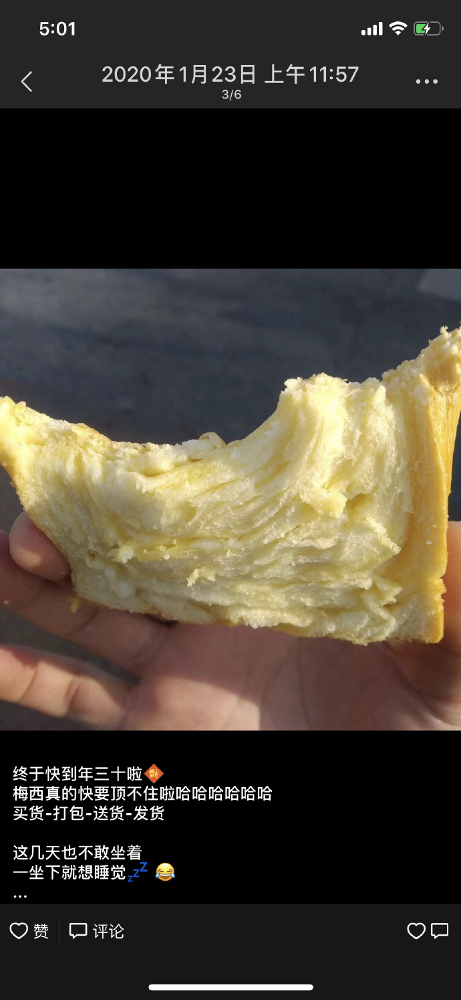

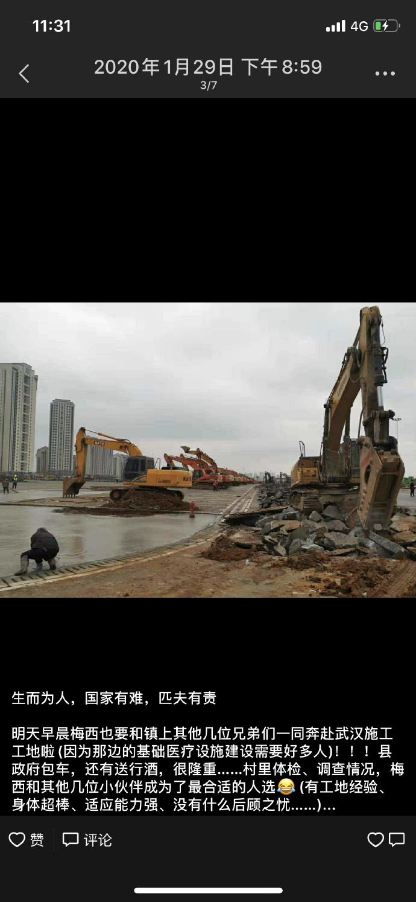
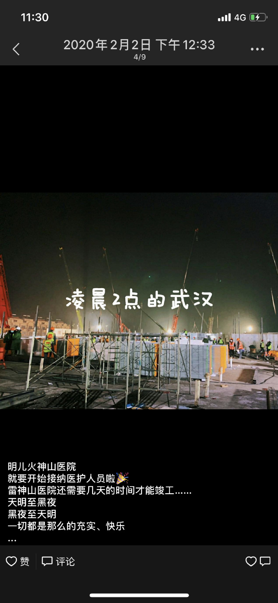
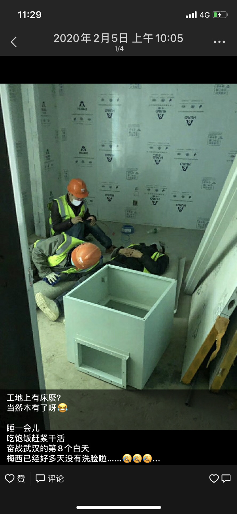
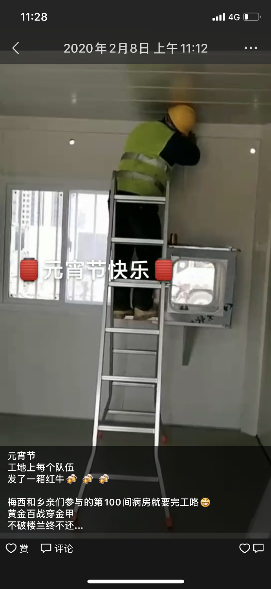
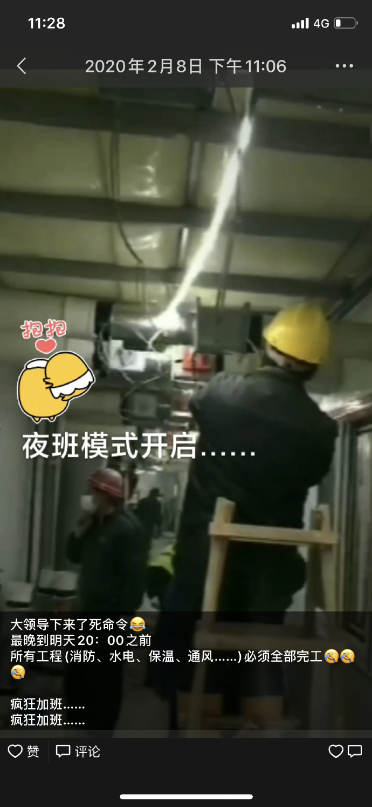
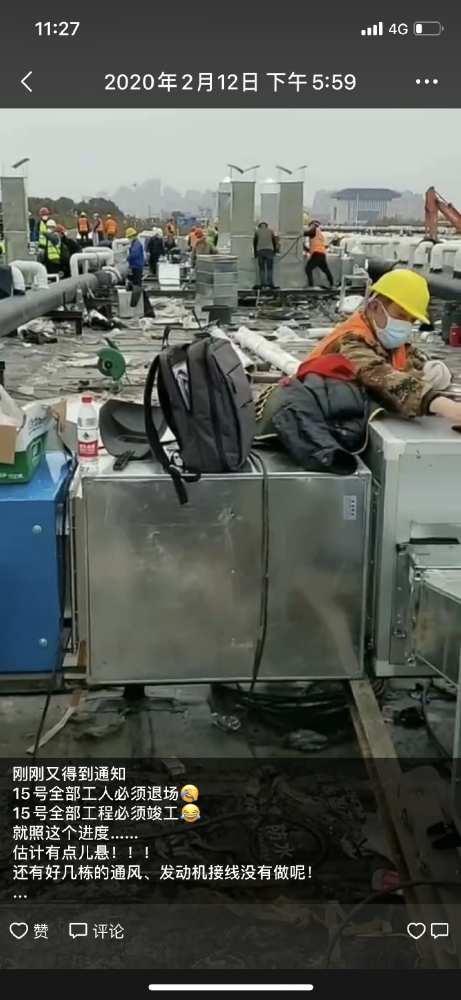
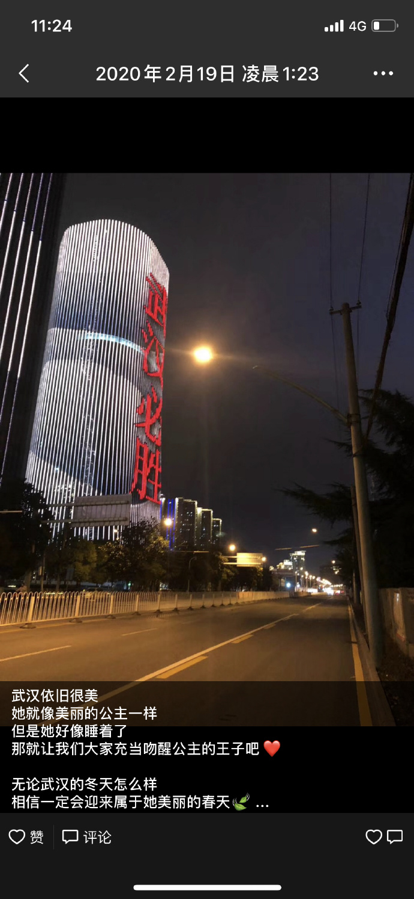
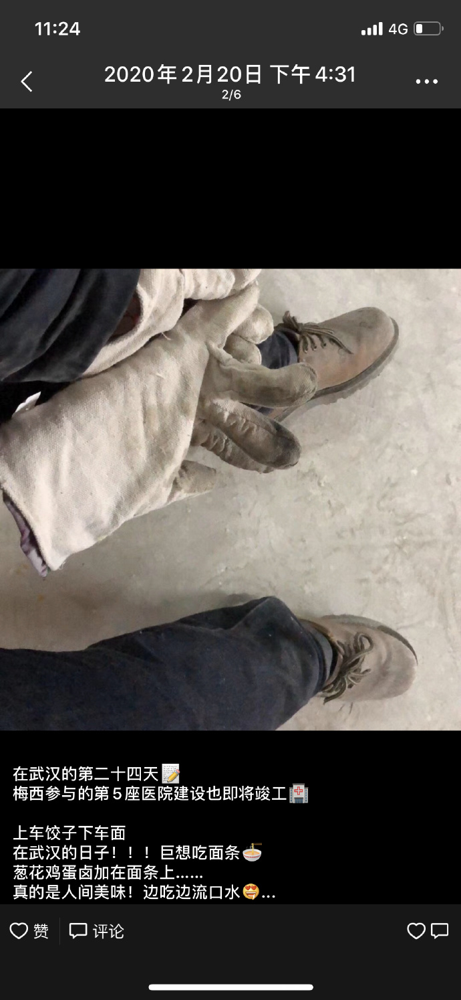
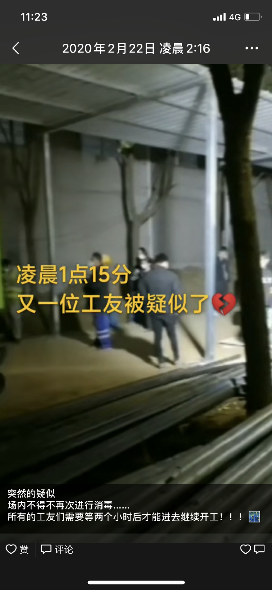
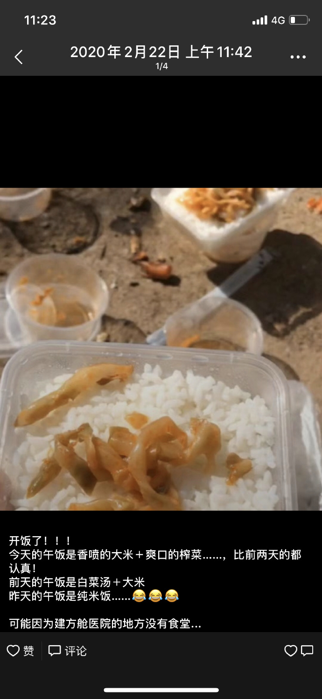
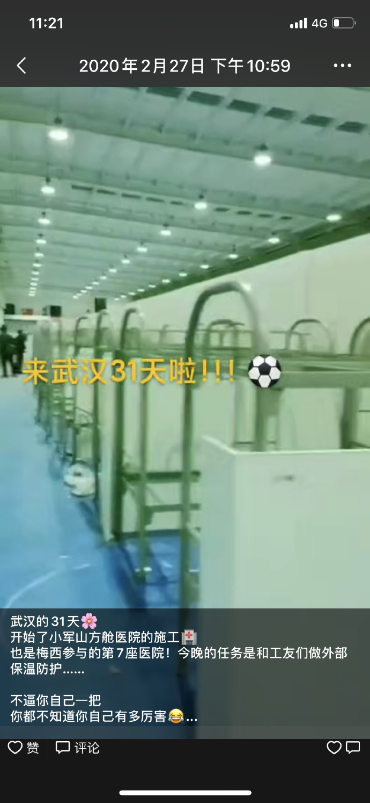

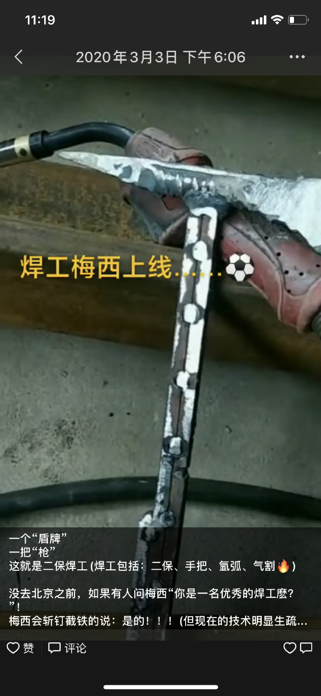
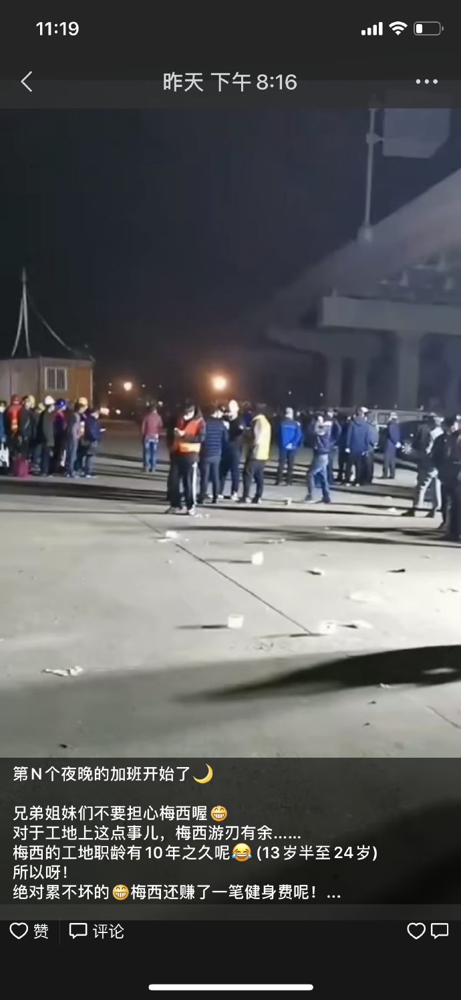
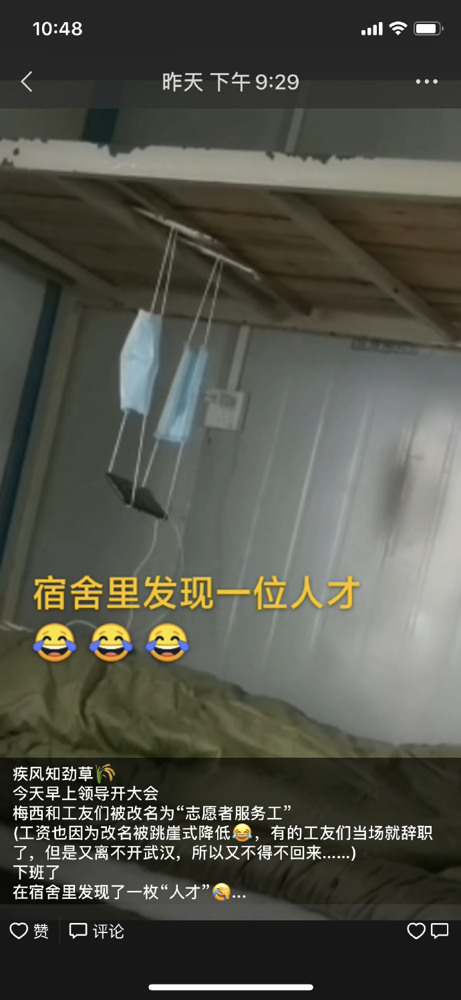
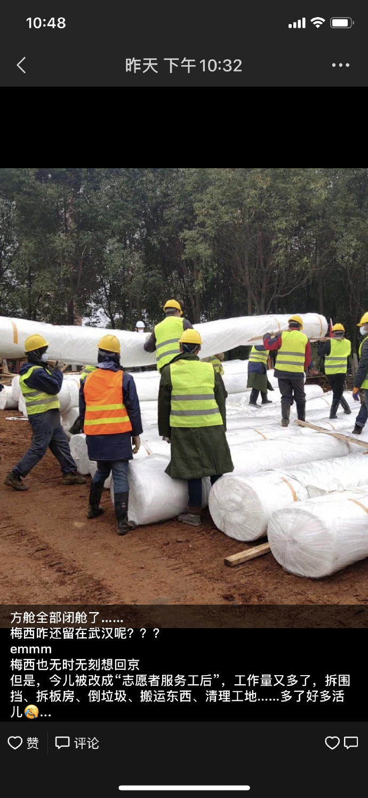
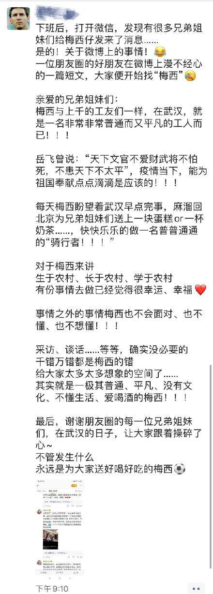
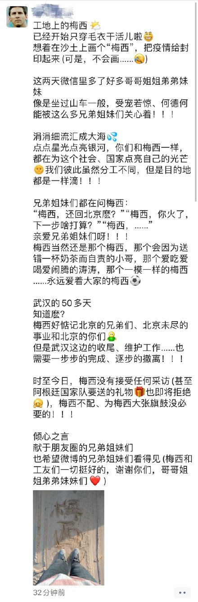
