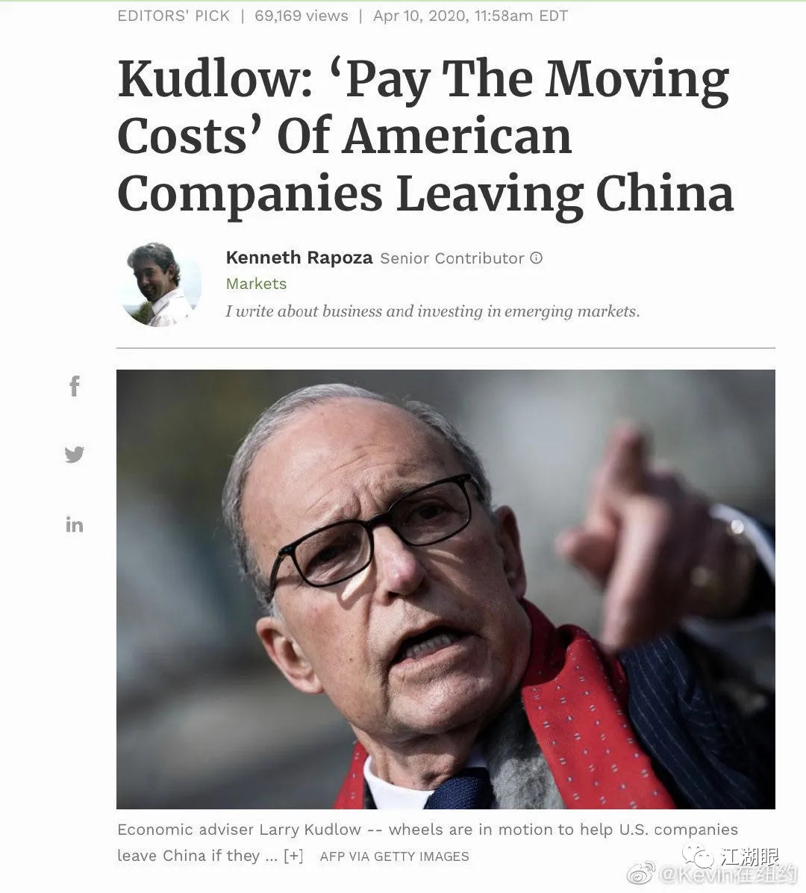
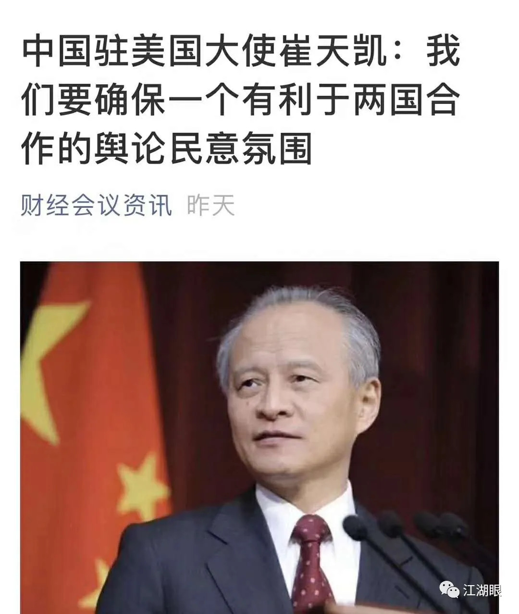
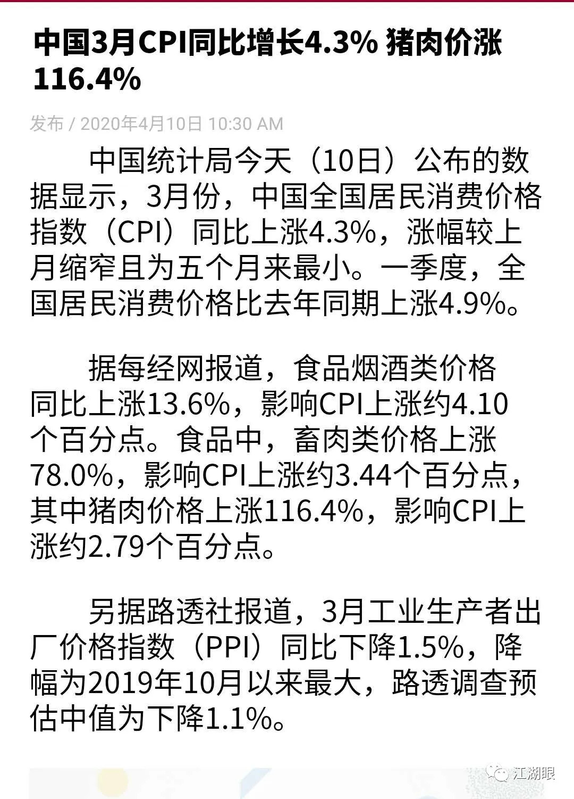
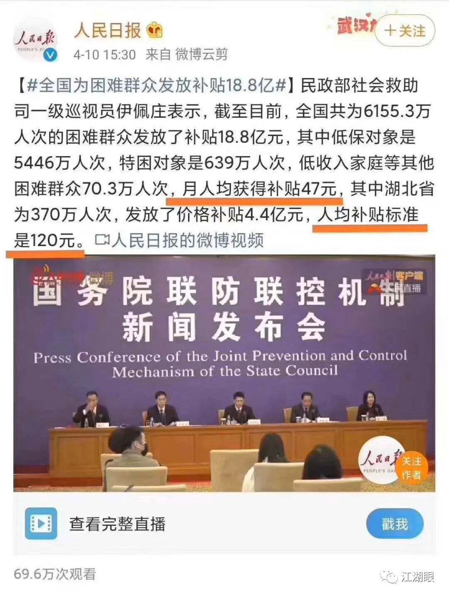

离开世界，你将一无所有
====================

原创 安梁 江湖眼 2020年4月17日

原文链接: [https://mp.weixin.qq.com/s/BQljEV2pRW18S3YpwA6XiA](https://mp.weixin.qq.com/s/BQljEV2pRW18S3YpwA6XiA)

拙作《[中国能否离开世界？](2020-04-09-中国能否离开世界)》受到读者喜爱，阅读量已经接近40万人。后台收到了数百条留言，有赞有弹，分裂严重。该文因此被没收了“留言功能”。总结争论的焦点，无外乎如何看待中国与世界的关系，以及如何判断中国未来的发展。从这些留言中，安梁看到，许多国人仍沉浸在大国梦里，不知危机已来。因此，再著一文，以回答大家的问题。

###我们啥时吃饱饭的？###

中国人是健忘的，从各种媒体和日常谈话中，很多人已经忘记了我们曾经的贫穷。我们啥时吃饱饭，或说口袋里有点钱的？

时光倒流回2000年，当时全国城镇居民人均月入523元，农村居民人均月入188元。除北上广深四大一线城市外普通公务员月工资不及1000元。

1986年，中国首次允许私人拥有小汽车，当时每辆上海产桑塔纳售价20万元。2000年，全国私人汽车保有量625.3万辆（含各类货车和大客车）；而到2019年底，中国私人小汽车达到2.07亿辆。说明至少97%现车主是在2001年以后才买了自己的小汽车。

2000年，中国批准公民出国（含公务、留学、劳务）310.9万人次，其中持护照旅游人数仅89.8万人次。2002年，中国人被允许自由办理护照。到2019年底，中国持有因私护照人数接近2亿。说明99.6%的人是在2001年以后才有护照，才能出国旅游的。

2000年，中国只有3.9万人出国留学，而且公派接近一半。现在中国在外国的留学生总数超过160万人，而且95%以上是自费。说明99%以上家庭是在最近20年才有经济实力把孩子送出国留学。

2000年，中国城镇居民人均住房面积10.25平方米，到2018年达到了39平方米，60%的住宅是2000年以后建好的。说明至少60%城镇居民是在2000年以后才买了新房。

由此可见，绝大多数中国人口袋里有点闲钱，是最近20年的事。这种生活水平，欧美人100年前就享受到了，而日本人至少享受了50年，而韩国、新加坡、中国台湾和香港人也享受了40年。

###我们的财富来自哪里？###

很多人以为，这20年我们有钱了，是因为我们勤劳，制度优越，所以是打遍天下无敌手的“厉害国”。其实，历史是一面很好的镜子，照出你本来的样子。

“文革”时期就不说，那时候不让人搞经济，穷也活该。但在“十一届三中全会”以后，中国已将工作重心转向经济建设，大力宣传勤劳致富，拜金思想泛滥。但当我们把10亿人的生产力释放出来以后，才发现我们生产的东西卖不出去。所以，朱镕基总理在1996-2000年的四年间“砸三铁”，近一亿国营和集体企业工人下岗，国企重镇东三省一片哀嚎，至今仍有后遗症。

因为中国的产能严重过剩，必须把产品卖到国际市场，我们才能实现人人有工作，人人有饭吃的发财梦想。但在1997年以前，中国外贸由国企垄断经营，中国产品无法打开市场，没有收支平衡，中国经济的火车头就无法发动。

在整个1980年代，中国外贸几乎年年逆差，累计逆差424亿美元，央妈只能将人民币贬值，币值从1985年的2.8元兑换1美元，逐步贬值到1990年的5.22元兑换1美元。人民币大幅贬值之后，出口立刻得到提振，从1990年到1992年的三年间，终于有了212亿美元的外贸顺差，但在1993年又出现122.15亿美元的巨额逆差。

朱镕基在1993年6月亲自出任中国人民银行行长，让人民币继续贬值。1993年12月29日，央妈突然宣布废除外汇券，汇率由市场定价。1994年1月1日，人民币兑换美元的价格从5.76元兑换1美元，下降至8.7元兑换1美元，一天之内暴跌30%。“中国制造”的价格优势大增，当年就有54亿美元顺差。

1997年1月1日，废除国营企业对外贸的垄断，搞活出口市场。当年的顺差超过404亿美元，同比增长282亿美元。1999年11月，中美达成支持中国加入WTO协议，2001年11月，中国正式加入WTO。从此，“中国制造”得以在以美国为首的国际市场热销。

1994-2004的十年间，中国累计外贸顺差3200亿美元，其中三大顺差来源地，分别为美国（1141.9亿美元）、香港（1122.5亿美元）和欧盟（701.1亿美元），合计达2964.5亿美元，占顺差总额的92.6%，其中来自香港的顺差多数是出口到美日欧的转口贸易。

中国外贸顺差主要来自外资企业。例如，2005年中国外企出口总额4442亿美元，占全国出口总额的58.3%，进口3875亿美元，占进口总额的58.7%，顺差567亿美元，占当年全国贸易顺差总额的55.64%。

美国是中国最大出口国家，也一直是中国贸易顺差的最重要来源地。从1986年到2019年，中国从美国市场净赚54075亿美元。从1949年到2000年的五十年間，中国贸易顺差累计1352亿美元，而从2001年到2019年的十九年間，中国贸易顺差累计4.65万亿美元，新中国70年的外贸顺差总计是47852亿美元。由此可见，来自美国的贸易顺差比过去70年中国贸易顺差的总和还多6223亿美元。常年巨额的贸易逆差，也是中美贸易争端的根源所在。

随着贸易顺差的大幅增加，中国外汇储备也增长到2014年底的4万亿美元。因为大量美元流入，央妈才得以美元为锚，源源不断地印钞票。

1994年中国的人民币M2总量为4.69万亿元，2000年增长到13.46万亿元，2020年1月更多达202.31万亿元。25年间，中国的货币量增加了43倍多。于是，我们有了大把钞票。

###目前的最大困境是什么？###

新冠病毒造成的全球疫情，不仅大幅减少了人员流动，也减少了货物、资金的流动，出现了第二次世界大战以来最大规模的全球性经济萎缩。

中国目前至少面临四重困境：第一，全国性的经济急遽下行；第二、世界经济停顿导致的全球性消费萎缩；第三、国际关系陷入高度敏感期；第四，“逆全球化”和“去中国化”同时存在。

关于第一个困境，相信被困在家里两个多月的人自有体会。统计局3月份数据显示，1-3月出口减13%，进口减少3%，1-3月的贸易顺差132亿美元，同比减少82%。三大固定投资均大幅下滑：制造业下降31.5%，房地产下降16.3%，基建下降29.8%。看到这些，就该知道苦日子还在后头。

关于第二个困境，由于疫情导致美欧日等主要经济体停摆，国际市场需求急遽萎缩。虽然中国的疫情已基本控制，据说80%以上企业已经复工，但是建立在全球市场之上的“世界工厂”，如果没有了“世界”，还有工厂吗？工厂关门和工人失业，在未来6个月必然大幅增加。

此次疫情，第一波在中国及其周边国家和地区，第二波在欧美，第三波估计在印度等南亚次大陆和非洲、拉丁美洲，也许今年都没有办法消停，谁也不知道隧道何时能见光。

关于第三个困境，经过各色战狼、小粉红以及媒体的轮番战斗，几乎得罪了全世界，甚至连最友好的泰国和非洲都惹怒了。等疫情过后，我们如何与世界交往，如何从国际市场赚钱？安梁怕被骂，这个问题不展开。

关于第四个困境，“逆全球化”和“去中国化”已经若隐若现。全球生产链的中国环节有脱落的危险。美国白宫首席经济顾问库德洛建议给撤回美国的企业100%报销费用，日本推出22亿美元预算帮助日本企业撤离中国。

4月14日，日本贸易振兴机构（JETRO）调查发现，有8.3%的华南地区日资企业因为此次疫情而决定将其业务撤离中国，主要回流日本或搬去越南。

目前有些获得防疫物资订单的中国公司，却把伪劣产品出口到美国，不仅自断财路，还伤及本份商家。美国杜邦公司就把他们的675万套防护服订单给了越南。

此外，为了维持货币金融的流行性稳定，2020年3月19日，美联储安排了4500亿美元，与瑞典、丹麦、挪威、澳大利亚、新西兰、墨西哥、巴西、韩国、新加坡等9国中央银行进行了临时美元互换安排。不到半个月，美联储又在3月底宣布设立海外央行回购工具，在已有的美元互换基础上，进一步加码向全球提供美元流行。

这是自2007年12月，美联储为因应次贷危机与日本、英国、瑞士、加拿大和欧洲央行达成货币互换协议之后，又一次稳定全球金融市场的举动。一个可怕的事实是，人民币被明确排除在这个正在形成的新国际货币金融体系之外。

###如何走出困境？###

中国驻美大使崔天凯最近频频主动约见美国媒体，释放善意。他强调，他的重要工作之一“就是确保一个有利于两国合作的舆论民意氛围”。所以，安梁认为，只有营造一个良好的舆论环境，才能帮助中国人赢得世界的尊重。

走出困境的途径无非三条：第一，给老百姓和提供最多就业机会的中小企业切实帮助；第二，加大市场化改革步伐，稳定外资企业，国有企业退出竞争性领域，为中外企业创造一个公平公开和法治的营商环境；第三，改善国际关系，特别要搞好与大客户美国、欧盟和日本的关系，让国际社会相信中国的发展不会威胁周边的安全。

其中，第一条件关乎民生，也最为重要。国内许多民众已经看到全世界几乎都在开仓赈灾，我们虽然也有一些救助措施，但远远不能抵消物价上涨带来的损失。例如，受灾最重的武汉刚宣布4月15日开始，武汉市民可领取惠民消费券，共2000万元，相当于人均2元。这不是恩惠，这是侮辱。

给受灾群众实实在在的帮助，对那些因疫情被困在家里而没有收入来源的人发放粮食或现金补助。可以参照其他国家的做法，按照2019年的全国人均可支配收入水平（每月2561元），给予两个月的补助，即每名成年人5122元，每名儿童减半2561元，让大家免于饥饿的恐惧。还应该为经营困难的企业支付员工工资，以减轻失业压力。
