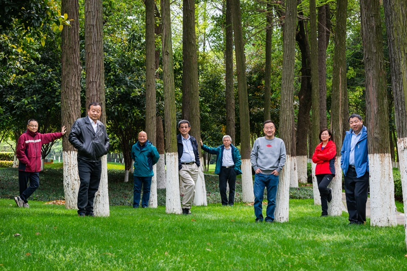

武汉抗疫的中国重症医学专家
========================

*短评: 感谢你们的救死扶伤。*

原文链接: [财新周刊|武汉：进入ICU逾两月的重症新冠病人怎么样了？](http://weekly.caixin.com/2020-04-18/101544129.html)

一批中国最顶尖的重症医学专家在武汉抗疫一线战斗近三个月。从右至左依次为，北京协和医院内科重症医学科主任杜斌、北京宣武医院重症医学科主任姜利、北京朝阳医院副院长童朝晖、东部战区总医院呼吸与危重症医学科主任医师赵蓓蕾、东南大学附属中大医院副院长邱海波、苏北人民医院重症医学科主任郑瑞强、中山大学附属第一医院重症医学科主任管向东、四川大学华西医院重症医学科主任康焰。 

图/中国人口报摄影部主任 潘松刚

